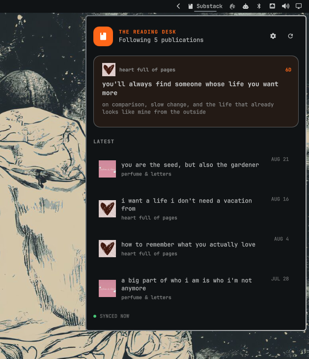

# Omarchy Substack Feed

A calm, native reading desk for the Omarchy bar. It discovers the free and
paid Substack publications attached to your account, watches their RSS feeds,
sends desktop notifications for genuinely new posts, and opens stories in your
normal browser.

It is intentionally **not** an article reader. Paid content and full article
bodies stay on Substack.



## Install

```bash
omarchy plugin add https://github.com/0x4A756E65/omarchy-substack.git --enable
```

Click the Substack item in the bar, choose **Connect Substack**, and sign in on
Substack's own page. Password sign-in is the most reliable option; email codes
and pasted one-time links are also supported.

Update a Git-managed installation with:

```bash
omarchy plugin update aaron.substack
```

## Remove

First open the plugin settings and choose **Log out**. This deletes the session
from the desktop keyring and clears the local feed. Then remove the plugin:

```bash
omarchy plugin remove aaron.substack
```

Removal does not change subscriptions on Substack or overwrite other Omarchy
configuration.

## What it does

- Discovers the signed-in reader's current subscriptions.
- Excludes publications you administer by default, so your own posts do not
  take over the reading queue.
- Polls each publication's canonical `https://<subdomain>.substack.com/feed`.
- Uses ETag and Last-Modified validators to avoid downloading unchanged feeds.
- Seeds the initial feed silently, then marks and notifies only later unseen
  posts.
- Adapts polling frequency to each publication and exponentially backs off
  after errors.
- Keeps polling already-discovered RSS feeds if the Substack session expires.
- Uses real Substack publication artwork when available and never invents
  placeholder avatars.
- Rejects network redirects and limits authenticated requests to Substack's
  exact HTTPS origin.

## Settings

Open the gear in the panel to control:

- Publication artwork
- The scrolling newest-post headline in the bar
- Desktop notifications
- Whether publications you administer appear in the feed
- Immediate subscription/feed resync
- Account reconnection
- Logout and local-feed removal

Logging out removes the Substack session from the desktop keyring and clears
the local feed. It does not unsubscribe from anything on Substack.

## Controls

- Left click: open or close the reading desk.
- Middle click: resync subscriptions and feeds.
- Right click: mark all unread posts as read.
- Click a story or notification: mark it read and open it in the default
  browser.

## Security and storage

The plugin never receives or stores your password. Authentication happens in a
dedicated ephemeral WebKit window displaying Substack's website. After a
successful login, only Substack's session cookie is saved in the desktop Secret
Service keyring.

Feed state lives at:

```text
~/.local/state/omarchy/substack/state.json
```

The state file contains publication and article metadata, but no session
cookie. The cookie is never written to `shell.json`, the repository, or the
plugin directory.

The temporary sign-in window rejects navigation outside Substack and its
Cloudflare challenge origin, blocks permission requests, and displays the
current origin in its header. Publication and article text is always rendered
as plain text.

## Architecture and compatibility

Publication RSS feeds are an officially documented Substack feature. Account
subscription discovery currently uses the authenticated endpoint used by
Substack's web client because Substack does not publish an OAuth or reader API.
That endpoint is therefore treated as replaceable: several known response
shapes are normalized, subscription refresh failures retain the last good feed,
and existing RSS polling continues independently.

The authenticated `/api/v1/reader/feed` endpoint was evaluated but is not used
for the queue: it mixes posts with comments, suggestions, and other social-feed
items. Canonical publication RSS is smaller, more predictable, and a better
fit for notifications.

Runtime dependencies are provided by Omarchy: Quickshell, Python 3, GTK 3,
WebKitGTK 4.1, and the Secret Service command-line client (`secret-tool`). The
plugin has no third-party Python packages, install hooks, privileged commands,
or bundled executable dependencies.

Security reports are welcome through GitHub's private vulnerability reporting
flow; see [SECURITY.md](SECURITY.md).

This project is independent and is not affiliated with or endorsed by
Substack.

## Development

```bash
omarchy plugin validate .
python3 -m unittest discover -s tests -v
python3 -m py_compile substack_backend.py
```

Useful local commands:

```bash
python3 substack_backend.py status
python3 substack_backend.py refresh
python3 substack_backend.py disconnect
```

## License

MIT
